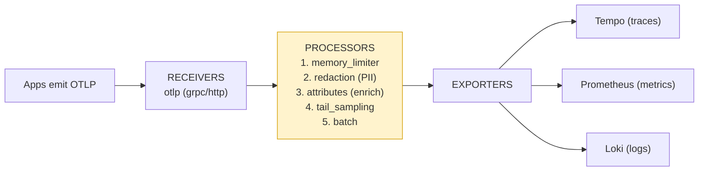

# Observability for Every Agent, Every Model, Every User — Built on OpenTelemetry

When I first tried to monitor our AI systems, I made the mistake almost everyone
makes: I treated each agent as its own little island. One agent shipped logs to
CloudWatch. Another printed token counts to stdout. A third had a homegrown
dashboard a contractor built and then left. When someone asked "how much are we
spending on LLM calls across the whole company, and which users drive it?" the
honest answer was a week of spreadsheet archaeology.

The fix wasn't a tool. It was a *standard.* The moment we decided that every agent,
every model call, and every user session would emit telemetry in **one shape —
OpenTelemetry's GenAI conventions** — the islands turned into a continent. One
pipeline, one query language, one dashboard, and suddenly that "how much are we
spending" question was a thirty-second answer.

This is the full guide to building that. It's vendor-neutral on purpose: I'll show
you the architecture, then deep-dive every component — instrumentation, the
semantic conventions, the Collector, storage, and the three things you actually
want to watch (agents, LLMs, users). You can run the whole thing open-source
(Grafana stack) or point it at any commercial backend. The instrumentation doesn't
change. That's the whole point.

---

## The one decision that matters: standardize the telemetry shape

Before any tool, make this commitment: **everything emits OpenTelemetry, following
the GenAI semantic conventions.**

Here's why this is the load-bearing decision and not a detail:

- **Portability.** Instrument once. If you switch backends — Jaeger to Tempo,
  Prometheus to Datadog, self-hosted to SaaS — your code doesn't change. You
  reconfigure one Collector and move on. No re-instrumentation, no lock-in.
- **One vocabulary.** When your agent spans, your model calls, and your tool calls
  all use the same attribute names (`gen_ai.usage.input_tokens`,
  `gen_ai.request.model`, `gen_ai.operation.name`), you can write *one* dashboard
  query that works across every team's agent. Without it, every team invents its
  own field names and nothing aggregates.
- **The ecosystem already speaks it.** Bedrock AgentCore, Azure AI Foundry,
  LangSmith, Databricks, Datadog, Grafana — they all ingest OTel. You're joining a
  standard, not betting on a vendor.

Everything below assumes this foundation. If you take nothing else away: pick OTel,
pick the GenAI conventions, and enforce them everywhere.

---

## The architecture at a glance

Here's the whole system on one page. Three sources of telemetry (agents, LLMs,
users) flow through your application's instrumentation, into a Collector, and out
to storage and dashboards.

<!-- ```mermaid
flowchart TD
    subgraph SOURCES["What we instrument"]
        AGENT["AI Agents<br/>(reasoning, tool calls)"]
        LLM["LLM calls<br/>(any provider)"]
        USER["User sessions<br/>(who, what, consent)"]
    end

    AGENT --> SDK["OpenTelemetry SDK<br/>+ GenAI instrumentation<br/>(in your app)"]
    LLM --> SDK
    USER --> SDK

    SDK -->|"OTLP (gRPC/HTTP)"| COL["OpenTelemetry Collector"]

    subgraph COLPIPE["Inside the Collector"]
        REC["Receivers<br/>(OTLP in)"] --> PROC["Processors<br/>(batch, redact PII,<br/>tail-sample, attributes)"]
        PROC --> EXP["Exporters<br/>(fan out)"]
    end

    COL -.-> COLPIPE

    EXP -->|"traces"| TRACE["Trace store<br/>(Tempo / Jaeger)"]
    EXP -->|"metrics"| METRIC["Metric store<br/>(Prometheus / Mimir)"]
    EXP -->|"logs"| LOG["Log store<br/>(Loki / OpenSearch)"]

    TRACE --> DASH["Grafana<br/>(or any backend)"]
    METRIC --> DASH
    LOG --> DASH

    DASH --> PEOPLE["Engineers · On-call · Finance · Leadership"]

    style SDK fill:#fff3cd,stroke:#d39e00
    style COL fill:#fff3cd,stroke:#d39e00
    style COLPIPE fill:#fffdf5,stroke:#d39e00
    style DASH fill:#d4edda,stroke:#28a745
``` -->

Plain-text version:

```
  Agents ─┐
  LLMs  ──┼──► OTel SDK (in app) ──OTLP──► OTel Collector ──┬──► Traces  (Tempo/Jaeger)
  Users ──┘                                                 ├──► Metrics (Prometheus)
                                                            └──► Logs    (Loki)
                                                                   │
                                                                   ▼
                                                              Grafana / any backend
                                                                   ▼
                                              Engineers · On-call · Finance · Leadership
```

Five components, and we'll deep-dive each one:

1. **Instrumentation** — the SDK in your app that creates spans, metrics, logs.
2. **Semantic conventions** — the agreed names and shapes for AI telemetry.
3. **The Collector** — the central pipeline that receives, processes, and routes.
4. **Storage & visualization** — where telemetry lands and how you read it.
5. **The three subjects** — agents, LLMs, and users, each with its own concerns.

---

## Component 1 — Instrumentation: where telemetry is born

This is the layer inside your application that actually produces the data. You have
two ways to do it, and you'll use both.

### Auto-instrumentation (start here)

For common LLM SDKs (OpenAI, Anthropic, Bedrock, LangChain, etc.), libraries like
**OpenLLMetry** or **OpenInference** patch the client so every model call emits a
span automatically — no code changes. This is the fastest path to "I can see
something."

```python
# pip install traceloop-sdk   (OpenLLMetry — auto-instruments LLM SDKs)
from traceloop.sdk import Traceloop

Traceloop.init(
    app_name="support-platform",
    api_endpoint="http://otel-collector:4318",   # point at YOUR Collector
)

# From here, every OpenAI / Anthropic / Bedrock call emits a `chat` span
# with model, token usage, and latency — automatically.
from openai import OpenAI
client = OpenAI()
client.chat.completions.create(
    model="gpt-4o",
    messages=[{"role": "user", "content": "Summarize this ticket."}],
)
# ^ a `chat gpt-4o` span with gen_ai.usage.* attributes now exists.
```

### Manual instrumentation (for the parts that matter)

Auto-instrumentation captures model calls. It does *not* understand your agent's
reasoning loop, your tool calls, or your user context — those are yours to mark up.
This is where you wrap meaningful operations in spans by hand.

```python
from opentelemetry import trace
from opentelemetry.sdk.trace import TracerProvider
from opentelemetry.sdk.trace.export import BatchSpanProcessor
from opentelemetry.exporter.otlp.proto.grpc.trace_exporter import OTLPSpanExporter
from opentelemetry.sdk.resources import Resource

# Configure once, at app startup
resource = Resource.create({
    "service.name": "support-agent",
    "service.version": "2.4.1",
    "deployment.environment": "production",
})
provider = TracerProvider(resource=resource)
provider.add_span_processor(
    BatchSpanProcessor(OTLPSpanExporter(endpoint="http://otel-collector:4317"))
)
trace.set_tracer_provider(provider)

tracer = trace.get_tracer("support-agent")
```

The `Resource` is important and easy to skip: it tags *every* span from this
service with `service.name`, `version`, and `environment`. That's how you later
filter "show me only production traces from the support-agent v2.4.1." Set it once
and forget it.

---

## Component 2 — The semantic conventions (the deep dive that pays off)

This is the heart of the whole thing, and the part most teams underinvest in. The
OpenTelemetry **GenAI semantic conventions** define the standard span names,
attributes, and metrics for AI workloads. Follow them and your telemetry composes;
ignore them and you're back to islands.

> **A note on naming, because the spec moved.** The GenAI conventions now live in
> their own repository (`open-telemetry/semantic-conventions-genai`), and one
> attribute was renamed in the process: the provider is **`gen_ai.provider.name`**,
> *not* the older `gen_ai.system`. Likewise the finish reason is
> **`gen_ai.response.finish_reasons`** — an *array*, plural. If you're copying
> examples from older blog posts (or older versions of this one), update those two.
> The values below reflect the current spec.

### The operations and their spans

The spec defines a span per *operation*, named `{operation} {target}`. The full set
that matters for an agentic system:

| `gen_ai.operation.name` | Span name pattern | Span kind | When |
|---|---|---|---|
| `create_agent` | `create_agent {agent.name}` | CLIENT | Agent/assistant is created or configured |
| `invoke_agent` | `invoke_agent {agent.name}` | CLIENT (remote) / INTERNAL (local) | The whole agent run — top-level |
| `plan` | `plan {agent.name}` | INTERNAL | A planning/reasoning step |
| `invoke_workflow` | `invoke_workflow {workflow.name}` | INTERNAL | A multi-agent workflow run |
| `chat` | `chat {request.model}` | CLIENT | A model inference call |
| `execute_tool` | `execute_tool {tool.name}` | INTERNAL | A tool / function call |
| `embeddings` | `embeddings {request.model}` | CLIENT | An embeddings call |

### The attributes that matter most

These are the names to memorize — they're what your dashboards key on. Requirement
levels in brackets are from the spec (Required / Conditionally Required / Recommended
/ Opt-In):

```
# Operation & provider
gen_ai.operation.name        [Required]      # create_agent | invoke_agent | plan |
                                             #   chat | execute_tool | embeddings | invoke_workflow
gen_ai.provider.name         [Required*]     # "openai" | "anthropic" | "aws.bedrock" | "gcp.vertex_ai"
                                             #   (*required on client spans; replaces old gen_ai.system)

# Agent identity
gen_ai.agent.id              [Cond. Req.]    # stable provider-assigned agent ID
gen_ai.agent.name            [Cond. Req.]    # human-readable agent name
gen_ai.agent.description     [Cond. Req.]    # what the agent does
gen_ai.conversation.id       [Cond. Req.]    # session / thread ID  ← ties a story together

# Request parameters
gen_ai.request.model         [Cond. Req.]    # "gpt-4o", "claude-3-5-sonnet", ...
gen_ai.request.temperature   [Recommended]
gen_ai.request.max_tokens    [Recommended]
gen_ai.request.top_p         [Recommended]
gen_ai.request.choice.count  [Cond. Req.]    # number of candidate completions requested
gen_ai.request.seed          [Cond. Req.]

# Usage — these drive every cost dashboard
gen_ai.usage.input_tokens                [Recommended]   # prompt tokens
gen_ai.usage.output_tokens               [Recommended]   # completion tokens
gen_ai.usage.cache_creation.input_tokens [Recommended]   # tokens written to prompt cache
gen_ai.usage.cache_read.input_tokens     [Recommended]   # tokens served from cache (cheap!)

# Response
gen_ai.response.model            [Recommended]   # what actually served (can differ from request)
gen_ai.response.finish_reasons   [Recommended]   # ARRAY: ["stop"], ["length"], ["tool_calls"]
gen_ai.output.type               [Cond. Req.]    # "text" | "json" | "image" | "speech"

# Tools, data, workflow, server, errors
gen_ai.tool.name             [Cond. Req.]
gen_ai.tool.call.id          [Cond. Req.]
gen_ai.data_source.id        [Cond. Req.]    # e.g. the Knowledge Base / vector store ID
gen_ai.workflow.name         [Cond. Req.]
server.address               [Recommended]   # the GenAI endpoint host
server.port                  [Cond. Req.]
error.type                   [Cond. Req.]    # set when the operation fails
```

> **Cache tokens are not optional bookkeeping — they're real money.** Providers bill
> cache *reads* at a fraction of normal input tokens. If you only record
> `input_tokens` you'll over-report cost on every cached call. Capture
> `cache_read.input_tokens` and `cache_creation.input_tokens` and your cost numbers
> actually match the invoice.

### A fully convention-compliant model-call span

Here's what a hand-rolled `chat` span looks like when you follow the conventions
to the letter. Auto-instrumentation produces something like this for you; doing one
by hand once is the best way to understand what's flowing.

```python
from opentelemetry.trace import SpanKind

def call_model(prompt: str, session_id: str) -> str:
    with tracer.start_as_current_span(
        "chat claude-3-5-sonnet",                      # "{operation} {model}"
        kind=SpanKind.CLIENT,
        attributes={
            "gen_ai.provider.name": "anthropic",       # NOT gen_ai.system (renamed)
            "gen_ai.operation.name": "chat",
            "gen_ai.request.model": "claude-3-5-sonnet",
            "gen_ai.request.temperature": 0.2,
            "gen_ai.request.max_tokens": 1024,
            "gen_ai.conversation.id": session_id,
            "server.address": "api.anthropic.com",
        },
    ) as span:
        try:
            resp = anthropic_client.messages.create(
                model="claude-3-5-sonnet-20241022",
                max_tokens=1024,
                messages=[{"role": "user", "content": prompt}],
            )
        except Exception as exc:
            # Spec: classify the failure on error.type
            span.set_attribute("error.type", exc.__class__.__name__)
            span.record_exception(exc)
            raise

        # Record what came back — these drive cost and quality dashboards.
        u = resp.usage
        cache_read = getattr(u, "cache_read_input_tokens", 0)
        cache_write = getattr(u, "cache_creation_input_tokens", 0)
        # IMPORTANT (Anthropic): the API returns input_tokens WITHOUT the cached
        # tokens. The spec says gen_ai.usage.input_tokens MUST be the *total* — so
        # add cache_read back in for the attribute. (But price them differently —
        # see record_cost below, or you'll double-count cost.)
        span.set_attribute("gen_ai.usage.input_tokens", u.input_tokens + cache_read)
        span.set_attribute("gen_ai.usage.output_tokens", u.output_tokens)
        # Cache tokens — capture them or your cost numbers won't match the invoice
        span.set_attribute("gen_ai.usage.cache_read.input_tokens", cache_read)
        span.set_attribute("gen_ai.usage.cache_creation.input_tokens", cache_write)
        # finish_reasons is an ARRAY in the spec, even with one value
        span.set_attribute("gen_ai.response.finish_reasons", [resp.stop_reason])
        span.set_attribute("gen_ai.response.model", resp.model)
        return resp.content[0].text
```

### The metrics side (the deep dive)

Spans tell the story of one run; metrics aggregate across all runs. The conventions
define a specific set of metrics — names, instrument types, units, *and explicit
histogram bucket boundaries.* Emit these exactly as specified and your cost/latency
dashboards build themselves, and they're comparable across every team.

**Client-side metrics** (what your application emits):

| Metric | Type | Unit | Required attributes |
|---|---|---|---|
| `gen_ai.client.token.usage` | Histogram | `{token}` | `gen_ai.operation.name`, `gen_ai.provider.name`, **`gen_ai.token.type`** |
| `gen_ai.client.operation.duration` | Histogram | `s` | `gen_ai.operation.name`, `gen_ai.provider.name`, `error.type` (on failure) |

**Server-side metrics** (for those running inference infrastructure — these are how
you measure the experience of token *streaming*):

| Metric | Type | Unit | What it measures |
|---|---|---|---|
| `gen_ai.server.request.duration` | Histogram | `s` | Full request duration (time to last token) |
| `gen_ai.server.time_to_first_token` | Histogram | `s` | Latency until the *first* token streams (TTFT) |
| `gen_ai.server.time_per_output_token` | Histogram | `s` | Per-token latency after the first (TPOT) |

The single most-missed detail: **`gen_ai.token.type`**. The token-usage histogram is
recorded *once per token type* — `input` and `output` are separate data points, not
a sum. That's what lets you split prompt vs. completion cost later.

The spec also pins the bucket boundaries so histograms aggregate correctly across
producers. Set them explicitly rather than accepting SDK defaults:

```python
from opentelemetry import metrics
from opentelemetry.sdk.metrics import MeterProvider
from opentelemetry.sdk.metrics.view import View, ExplicitBucketHistogramAggregation

# Spec-defined buckets — token usage spans a huge range, so the boundaries are large
TOKEN_BUCKETS = [1, 4, 16, 64, 256, 1024, 4096, 16384, 65536,
                 262144, 1048576, 4194304, 16777216, 67108864]
# Duration buckets are the standard latency ladder, in seconds
DURATION_BUCKETS = [0.01, 0.02, 0.04, 0.08, 0.16, 0.32, 0.64, 1.28,
                    2.56, 5.12, 10.24, 20.48, 40.96, 81.92]

provider = MeterProvider(views=[
    View(instrument_name="gen_ai.client.token.usage",
         aggregation=ExplicitBucketHistogramAggregation(TOKEN_BUCKETS)),
    View(instrument_name="gen_ai.client.operation.duration",
         aggregation=ExplicitBucketHistogramAggregation(DURATION_BUCKETS)),
])
metrics.set_meter_provider(provider)

meter = metrics.get_meter("support-agent")
token_usage = meter.create_histogram(
    "gen_ai.client.token.usage", unit="{token}",
    description="Number of input and output tokens used",
)
op_duration = meter.create_histogram(
    "gen_ai.client.operation.duration", unit="s",
    description="GenAI operation duration",
)
```

And record them — note input and output go in as **two separate measurements**, each
tagged with its `gen_ai.token.type`:

```python
base = {
    "gen_ai.operation.name": "chat",
    "gen_ai.provider.name": "anthropic",
    "gen_ai.request.model": "claude-3-5-sonnet",
}
token_usage.record(u.input_tokens,  {**base, "gen_ai.token.type": "input"})
token_usage.record(u.output_tokens, {**base, "gen_ai.token.type": "output"})
op_duration.record(elapsed_seconds, base)   # add "error.type" if it failed
```

Those dimension labels are what let you ask "input vs. output tokens per model per
day" or "P95 latency for Bedrock chat calls" later — without changing any code.

> **The rest of the spec.** This section covers the parts of the GenAI conventions
> you touch daily. The spec folder (`docs/gen-ai/`) has more: the full `execute_tool`
> and `embeddings` spans, the exception event vs. `error.type`, the content JSON
> schemas (including **retrieval documents** and **agent memory records**), **MCP**
> tracing across the agent-to-tool boundary, and per-provider attributes
> (`aws.bedrock.guardrail.id`, etc.). All of it is laid out in the companion:
> [genai-conventions-complete-reference.md](genai-conventions-complete-reference.md).

### Events: capturing prompts, responses, and eval results

Spans and metrics describe *shape and cost*; **events** carry the actual content and
quality signals. The current spec consolidated the old per-message events
(`gen_ai.user.message`, `gen_ai.choice`, etc.) into two events plus a set of opt-in
span attributes:

| Event | What it carries |
|---|---|
| `gen_ai.client.inference.operation.details` | The full inference detail: chat history, parameters, and the response — the content-level record of one call |
| `gen_ai.evaluation.result` | The outcome of an evaluation/judge run against a model output (score, label, explanation) |

Message content itself rides on **opt-in span attributes** (off by default, for good
privacy reasons):

```
gen_ai.input.messages        [Opt-In]   # the chat history sent to the model
gen_ai.output.messages       [Opt-In]   # the messages the model produced
gen_ai.system_instructions   [Opt-In]   # system prompt, captured separately
gen_ai.tool.definitions      [Opt-In]   # the tool specs the model could choose from
```

The `gen_ai.evaluation.result` event is the hook that closes the quality loop:
whenever an LLM-as-judge or canary eval scores a production response, emit it as this
event and your eval scores become first-class, queryable telemetry sitting right
next to the trace that produced them.

> **Opt-in means opt-in for a reason.** These four content attributes are off by
> default because prompts and responses routinely contain regulated data. Turn them
> on deliberately, per service, and lean on the Collector's redaction processor
> (Component 3) to scrub PII centrally before any of it lands in storage.

---

## Component 3 — The OpenTelemetry Collector (the deep dive)

The Collector is the most important piece of infrastructure in this whole setup,
and the one people understand least. It's a standalone service that sits between
your apps and your backends. **Everything flows through it.** Why bother instead of
shipping straight from the app to storage?

- **One control point.** Redact PII, sample, add attributes, and switch backends in
  *one place* instead of redeploying every app.
- **Decoupling.** Your apps don't know or care where telemetry ends up. Change the
  backend; the apps never notice.
- **Resilience.** The Collector batches, retries, and buffers so a backend hiccup
  doesn't block your agents.

It has a three-stage pipeline: **receivers → processors → exporters.**



### A production-grade Collector config, annotated

```yaml
# otel-collector-config.yaml
receivers:
  otlp:
    protocols:
      grpc:                       # apps push here on :4317
        endpoint: 0.0.0.0:4317
      http:                       # ...or here on :4318
        endpoint: 0.0.0.0:4318

processors:
  # 1. Protect the Collector from OOM under load — always first.
  memory_limiter:
    check_interval: 1s
    limit_mib: 1500

  # 2. Redact sensitive data BEFORE it leaves your network.
  #    Prompts/responses often contain PII — scrub it here, centrally.
  redaction:
    allow_all_keys: true
    blocked_values:
      - "[0-9]{3}-[0-9]{2}-[0-9]{4}"          # SSN
      - "[a-zA-Z0-9._%+-]+@[a-zA-Z0-9.-]+"     # email
      - "[0-9]{13,16}"                         # card-like numbers
    summary: debug

  # 3. Enrich every span with environment context.
  attributes:
    actions:
      - key: telemetry.pipeline
        value: "central-otel"
        action: insert

  # 4. Keep the interesting traces, drop the boring ones.
  #    Always keep errors + slow + high-token; sample the rest.
  tail_sampling:
    decision_wait: 10s
    policies:
      - name: keep-errors
        type: status_code
        status_code: {status_codes: [ERROR]}
      - name: keep-slow
        type: latency
        latency: {threshold_ms: 5000}
      - name: sample-the-rest
        type: probabilistic
        probabilistic: {sampling_percentage: 20}

  # 5. Batch for efficiency — always last before export.
  batch:
    timeout: 5s
    send_batch_size: 1024

exporters:
  otlp/tempo:                     # traces
    endpoint: tempo:4317
    tls: {insecure: true}
  prometheus:                     # metrics (scrape endpoint)
    endpoint: 0.0.0.0:8889
  loki:                           # logs
    endpoint: http://loki:3100/loki/api/v1/push

service:
  pipelines:
    traces:
      receivers: [otlp]
      processors: [memory_limiter, redaction, attributes, tail_sampling, batch]
      exporters: [otlp/tempo]
    metrics:
      receivers: [otlp]
      processors: [memory_limiter, batch]
      exporters: [prometheus]
    logs:
      receivers: [otlp]
      processors: [memory_limiter, redaction, batch]
      exporters: [loki]
```

Two things worth dwelling on, because they're where the value is:

- **Redaction in the Collector, not the app.** Centralizing PII scrubbing means one
  team owns it, one config governs it, and no individual app can leak by forgetting
  to scrub. This is the single biggest reason to run a Collector.
- **Tail sampling, not head sampling.** Head sampling decides whether to keep a
  trace *before* it runs (blind). Tail sampling waits until the trace finishes, so
  it can keep *every* error and slow run and only sample the boring successes. For
  AI workloads — where the rare failure is the whole point — this is the right call.

---

## Component 4 — Storage & visualization

The Collector fans your three signals to three stores. Pick whatever you like; the
instrumentation is identical either way.

| Signal | Open-source option | What it answers |
|---|---|---|
| **Traces** | Grafana Tempo / Jaeger | "Walk me through this one run, step by step" |
| **Metrics** | Prometheus / Mimir | "What's the trend across all runs?" |
| **Logs** | Grafana Loki / OpenSearch | "Show me the actual prompt/response/error" |

**Grafana** sits on top of all three and is where humans actually look. If you'd
rather not self-host, the exact same OTLP stream points at Datadog, New Relic,
Honeycomb, Grafana Cloud, or any OTel-native vendor — you change exporter config,
nothing else.

A docker-compose to stand the open-source stack up locally:

```yaml
# docker-compose.yaml (minimal local stack)
services:
  otel-collector:
    image: otel/opentelemetry-collector-contrib:latest
    command: ["--config=/etc/otel/config.yaml"]
    volumes: ["./otel-collector-config.yaml:/etc/otel/config.yaml"]
    ports: ["4317:4317", "4318:4318", "8889:8889"]
  tempo:
    image: grafana/tempo:latest
    command: ["-config.file=/etc/tempo.yaml"]
  prometheus:
    image: prom/prometheus:latest
  loki:
    image: grafana/loki:latest
  grafana:
    image: grafana/grafana:latest
    ports: ["3000:3000"]
```

---

## Component 5 — The three subjects, deep-dived

Now the payoff. With the pipeline in place, here's how you instrument the three
things you actually care about — and what each one tells you.

### Subject A — Agents

Agents are about *behavior*: did the reasoning go where it should? The signals that
catch ~80% of agent failures are cheap: **reasoning depth** (how many model calls)
and **tool-call count**. Wrap the run and track them.

```python
def run_agent(session_id: str, user_id: str, task: str) -> str:
    with tracer.start_as_current_span(
        "invoke_agent support-agent",          # "{operation} {agent.name}"
        kind=SpanKind.INTERNAL,                # INTERNAL for a local agent (CLIENT if remote)
        attributes={
            "gen_ai.operation.name": "invoke_agent",
            "gen_ai.provider.name": "anthropic",
            "gen_ai.agent.name": "support-agent",
            "gen_ai.agent.id": "support-agent-v2",
            "gen_ai.conversation.id": session_id,
            "enduser.id": user_id,            # ties the run to a user (see Subject C)
        },
    ) as span:
        model_calls, tool_calls = 0, 0
        # ... agent loop: each iteration may open a child span ...
        #   - a `plan` span (INTERNAL) for a reasoning/planning step
        #   - a `chat` span (CLIENT) for each model call
        #   - an `execute_tool` span (INTERNAL) for each tool call
        # increment model_calls / tool_calls as you go ...

        # These two are your cheapest failure detectors. They aren't in the spec's
        # attribute registry, so namespace them under your own prefix, not gen_ai.*
        span.set_attribute("app.agent.model_calls", model_calls)
        span.set_attribute("app.agent.tool_calls", tool_calls)
        if model_calls > 6:
            span.add_event("possible_reasoning_loop", {"model_calls": model_calls})
        return result
```

> **Keep custom attributes out of the `gen_ai.*` namespace.** That namespace is
> owned by the spec. Anything you invent — `model_calls`, an internal task ID — goes
> under your own prefix (`app.*`, `acme.*`). It keeps your telemetry forward-
> compatible when the spec adds new `gen_ai.*` keys.

**What to watch:** task success rate, human-intervention rate, model-calls-per-run
(loop detector), tool error rate, P95 end-to-end latency.

### Subject B — LLMs

LLMs are about *cost, latency, and quality* — independent of which agent uses them.
You want a per-call ledger that aggregates across every team. The `chat` spans and
`gen_ai.usage.*` metrics from Component 2 already give you this; the key is
recording **dollar cost**, since tokens alone don't speak finance's language.

There's no `gen_ai.cost.*` metric in the spec — cost is provider-specific pricing
applied to the standard token attributes. So derive it yourself from the
`gen_ai.usage.*` values, and crucially price **cache reads** separately, since
providers bill them at a steep discount:

```python
# Price table (USD per 1K tokens) — keep current per provider.
# cache_read is typically ~10% of the input price; cache_write a bit above input.
PRICING = {
    "claude-3-5-sonnet": {"in": 0.003, "out": 0.015, "cache_read": 0.0003, "cache_write": 0.00375},
    "gpt-4o":            {"in": 0.005, "out": 0.015, "cache_read": 0.0025,  "cache_write": 0.005},
}
cost_counter = meter.create_counter("app.gen_ai.cost.usd", unit="usd")  # custom → app.* prefix

# NOTE: pass the RAW uncached input_tokens here (NOT the spec attribute, which adds
# cache_read back in). Pricing the full input total AND cache_read separately would
# double-count the cached tokens.
def record_cost(model, uncached_in_tok, out_tok, cache_read_tok, cache_write_tok, user_tier):
    p = PRICING[model]
    usd = (
        (uncached_in_tok / 1000) * p["in"]              # full price, uncached only
        + (out_tok          / 1000) * p["out"]
        + (cache_read_tok    / 1000) * p["cache_read"]   # the discount that matters
        + (cache_write_tok   / 1000) * p["cache_write"]
    )
    cost_counter.add(usd, {
        "gen_ai.request.model": model,
        "gen_ai.provider.name": "anthropic",
        "user.tier": user_tier,        # slice spend by customer tier
    })
```

**What to watch:** tokens per completed task (split by `gen_ai.token.type`), cost
per completed task, cache-hit ratio (`cache_read` ÷ total input — a cheap, huge
cost lever), **time-to-first-token** and **time-per-output-token** for streaming UX,
error/timeout rate per provider (`error.type`), and burn-rate anomalies (alert when
spend runs >3× the rolling average — catches runaway spend in seconds, not at
month-end). Tracking cost *per model* also tells you when a cheaper model would do
the same job.

### Subject C — Users

This is the dimension teams forget, and it's the one leadership asks about first:
*who* is using the AI, and *how much*. The mechanism is one attribute —
`enduser.id` — stamped on every span, so you can group all telemetry by user or
tenant.

```python
from opentelemetry import baggage, context

def with_user_context(user_id: str, tenant_id: str, tier: str):
    # Baggage propagates these across every downstream span automatically,
    # even across service boundaries — so EVERY child span gets user context.
    ctx = baggage.set_baggage("enduser.id", user_id)
    ctx = baggage.set_baggage("enduser.tenant", tenant_id, context=ctx)
    ctx = baggage.set_baggage("user.tier", tier, context=ctx)
    return context.attach(ctx)
```

With this, you can answer: top users by token spend, per-tenant cost (essential for
usage-based billing), per-tier latency (are paying customers getting better
service?), and abuse detection (one user driving an anomalous share of calls).

> **The privacy line, drawn clearly.** `enduser.id` should be a *pseudonymous* ID
> (a hashed user key), never raw PII like an email or name. Combined with the
> Collector's redaction processor scrubbing prompts and responses, this lets you
> attribute *usage* to a user without storing *who they are or what they said* in
> your telemetry. Get consent where required, set short retention on anything
> content-level, and keep raw prompts out of long-lived storage by default.

---

## The dashboard I'd actually build

Three rows, one per subject, so anyone — engineer or exec — can read it in a glance:

| Row | Panels |
|---|---|
| **Agents** | Task success rate · model-calls-per-run (loop alarm) · tool error rate · P95 latency |
| **LLMs** | Tokens/day by model & token-type · cost/day by model · cache-hit ratio · TTFT / TPOT · P95 model latency · burn-rate anomaly · error rate by provider |
| **Users** | Top users by spend · cost by tenant · calls by tier · anomalous-user alert |

And the alerts that earn their keep:

- `model_calls_per_run > 6` → reasoning-loop tripwire
- `llm_cost_burn_rate > 3× rolling avg` → runaway spend
- `task_success_rate < 90%` over 15 min → quality regression / model drift
- `tool_error_rate` spike on any single tool → dependency problem
- single `enduser.id` > N% of total calls in an hour → possible abuse

---

## Rolling it out without boiling the ocean

You don't deploy all of this at once. The order that worked:

**Phase 1 — See something (1–2 weeks).** Stand up the Collector + Grafana stack.
Add auto-instrumentation to your highest-traffic agent. Goal: stop flying blind.
No manual instrumentation yet.

**Phase 2 — Standardize (next few weeks).** Add manual `invoke_agent` /
`execute_tool` spans and the GenAI attributes across your agents. Enforce the
conventions in code review. Turn on Collector-side redaction and tail sampling.
Now telemetry composes across teams.

**Phase 3 — Attribute and alert (next quarter).** Add `enduser.id` baggage and the
cost counter. Build the three-row dashboard and wire the alerts. Now you can answer
the cost-per-user and quality questions on demand.

**Phase 4 — Close the loop (ongoing).** Feed failed traces into evaluation
datasets, run continuous canary evals, and layer in security monitoring as agent
reach grows. Observability stops being insurance and becomes how you make the
agents better.

---

## The takeaway

The temptation is to buy a tool. The better move is to commit to a *standard* and
build a thin, well-designed pipeline around it. OpenTelemetry's GenAI conventions
are that standard. Instrument every agent, every model call, and every user session
in that one shape; funnel it all through a single Collector that redacts, samples,
and routes; and read it back in whatever backend you like.

Do that, and the question that used to take a week — *what are all our AI systems
doing, what do they cost, and who's driving it?* — becomes a dashboard you glance
at over coffee. That shift, from archaeology to a glance, is the entire return on
the investment. And because it's all OTel, none of it traps you: the day you
outgrow a backend, you change one config file and your years of instrumentation
come right along with you.

---

### References & further reading

- *OpenTelemetry GenAI Semantic Conventions* — `github.com/open-telemetry/semantic-conventions-genai` (the conventions moved here from the main semantic-conventions repo)
  - *GenAI agent spans* — `docs/gen-ai/gen-ai-agent-spans.md`
  - *GenAI metrics* — `docs/gen-ai/gen-ai-metrics.md`
  - *GenAI events* — `docs/gen-ai/gen-ai-events.md`
- *OpenTelemetry Collector — Configuration* — OpenTelemetry documentation
- *AI Agent Observability* — OpenTelemetry blog (2025)
- *OpenLLMetry / OpenInference* — open-source LLM auto-instrumentation
- *Grafana Tempo, Loki, Mimir* — Grafana Labs documentation
- *The 4 Pillars That Keep Your Agents From Burning $2,000 at 3 AM* — dev.to
- *Mastering AI Agent Observability: A Comprehensive Guide* — Medium / Online Inference
